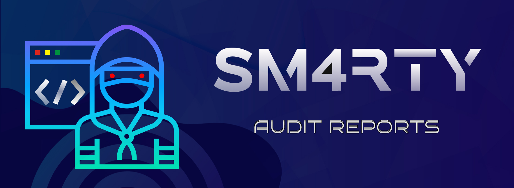

# Samrat's aka Sm4rty smart contract security reviews - audit reports and findings

## Independent Audits:

| Serial No. | Timeline | Project Name | Audit Report |
|-|-|-|-|
| 01.| 10/06/2023 - 13/06/2023 | [EtherVerse](https://www.etherverse.in/) | [Report](https://github.com/UNSNARL/audit-reports/blob/main/EtherVerse_SecurityAssessment_June2023.pdf) |
| 02.| 28/07/2023 - 05/08/2023 | [Kunji Finance](https://www.kunji.finance/) | [Report](https://github.com/UNSNARL/audit-reports/blob/main/Kunji_Finance_Security_Assessment.pdf) |
| 03.| 17/07/2023 - 24/08/2023 | [Payant Escrow](https://www.payant.io/) | [Report](https://github.com/UNSNARL/audit-reports/blob/main/Payant_Report.pdf) |
| 04.| 29/01/2024 - 06/03/2024 | [Dein Finance](https://dein.fi/) | *Comming Soon* |

---
## Public Contests Profile:
- **Code4rena**: https://code4rena.com/@Sm4rty
- **Sherlock**: https://audits.sherlock.xyz/watson/Sm4rty
- **CodeHawks**:https://www.codehawks.com/profile/clk4170ln003amb088n137st7

---

## Media and Contributions
  - Authored Economic Security Section of [Annual Web3 Security Report 2023](https://twitter.com/Sm4rty_/status/1742509722627170750?)
  - Co-Authored [DeFi Hacks Analysis - Root Cause Analysis Part2](https://web3sec.notion.site/c582b99cd7a84be48d972ca2126a2a1f?v=4671590619bd4b2ab16a15256e4fbba1)
  - Crafted a CTF Challenge "StakeKing" for [QuillCTF Dubai](https://twitter.com/Quill_Academy/status/1714519479760433469?s=20)
  - Co-Authored a Research Paper on [Analyzing Games in Maker Protocol Part One: A Multi-Agent Influence Diagram Approach Towards Coordination](https://twitter.com/Sm4rty_/status/1763536970029125964). Check out the Research paper [here](https://arxiv.org/abs/2402.15037).
  - Gave a talk at Opensense on [Auditing Tips](https://twitter.com/opensensepw/status/1703749320791543877).
  - Created a Notion template for organizing the Audit workflow. Check out it [here](https://sm4rty.notion.site/Audit-Workflow-f25e9a8b48d74f52a38396478a175829?pvs=4).
  - Got Featured by [Webacy](https://twitter.com/mywebacy/status/1682344864002764801) for sharing [web3 Security Tips](https://twitter.com/mywebacy/status/1682344867853217793).
  - Created Open Source Repo. focused on [Tezos Security](https://twitter.com/smudgechat/status/1671744108451201024?t=WR2LjWfWXJ9Mx9wN3uL7ww&s=08). Check it out here: [Awesome Tezos Security](https://github.com/Sm4rty-1/awesome-tezos-security)
  - Got Featured as a Community Partners with De.Fi Antivirus's [Web3 Security Conference 2023](https://twitter.com/De_FiSecurity/status/1708916121569534389?t=DJXBJ7dmcVU7EkHUNeqAeQ&s=08)
